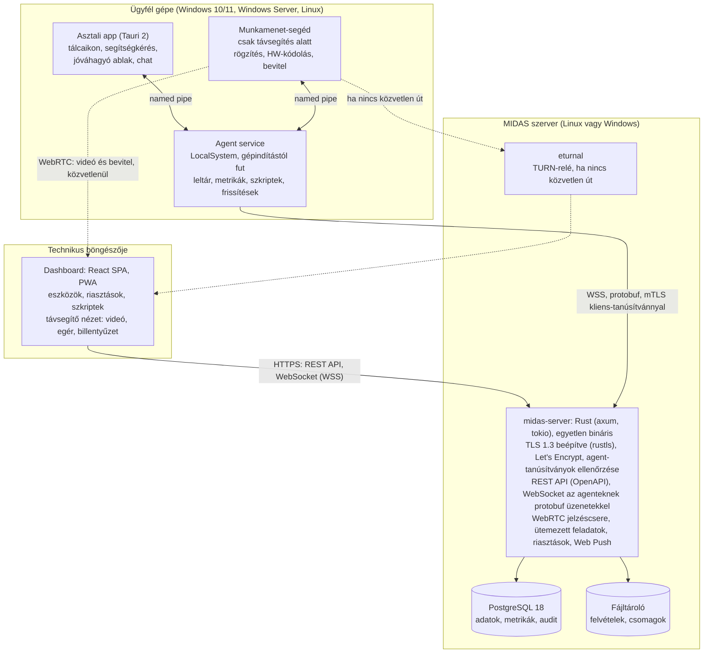
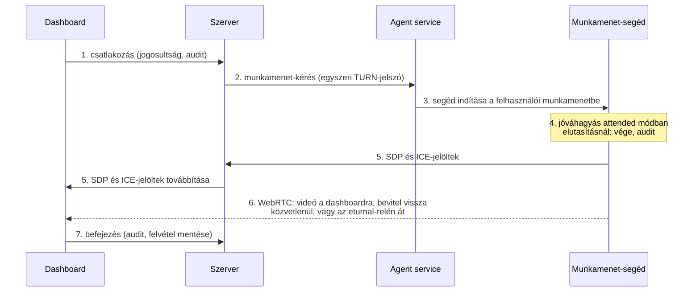
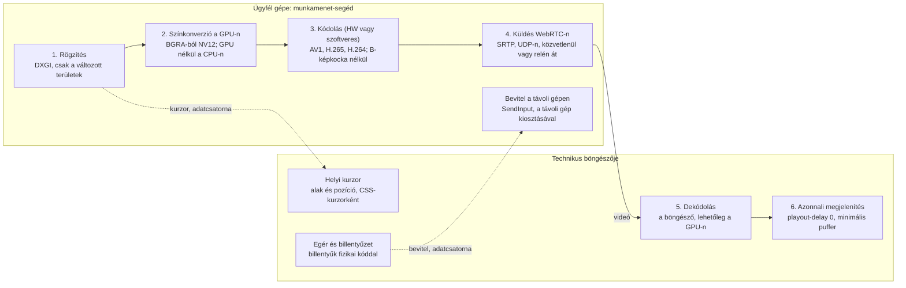

# MIDAS rendszerterv

Készült: 2026. szeptember 27. · Utoljára frissítve: 2026. szeptember 29. · Tulajdonos: [@Shran21](https://github.com/Shran21)

A feladatok a [mérföldkövekben](https://github.com/Shran21/MIDAS/milestones) és az [issue-kban](https://github.com/Shran21/MIDAS/issues) követhetők; a fázisok az [Ütemterv](#ütemterv) fejezetben vannak.

A MIDAS nyílt forráskódú (AGPL-3.0), több ügyfelet kiszolgáló távfelügyeleti (RMM) platform lesz: Rust nyelvű agent és szerver, böngészős dashboard mobilnézettel, Tauri asztali app, és WebRTC-videó a távsegítéshez, amely bármilyen videokártyán működik, és ahol lehet, hardveresen kódol. A szerver Linuxon és Windowson is fut, mindkettőhöz telepítővel; Visual Studio sehol nem kell. A régi terv funkcióterületei megmaradnak, újként bekerül az automatizált karbantartás; a macOS agent és a Kubernetes kimarad.

## Mi marad és mi változik

A régi terv funkciói maradnak, de minden technikai döntést nyelvtől függetlenül újravizsgáltunk. A szempontok sorrendje: biztonság, a távsegítés képminősége és késleltetése, Linuxon és Windowson futó szerver, modern és egyszerű felület. A táblázat a régi README-hez képest mutatja a változásokat.

| Terület | Régi terv | Új terv | Miért |
| --- | --- | --- | --- |
| Nyelv (agent és szerver) | C# / .NET 8 | Rust | Memóriabiztos szemétgyűjtő nélkül, nincs futásidejű szünet a képfolyamban, egyetlen kis bináris. |
| Képernyőátvitel | Képkockák SignalR WebSocketen | WebRTC-videó, hardveres AV1, H.265 vagy H.264 kódolással | A GPU kódol, a böngésző hardveresen dekódol, a sávszélesség folyamatosan igazodik. |
| Egérmutató | A képbe égetve | Külön adatcsatornán, a technikus gépe rajzolja | A mutató akkor is azonnal mozog, ha a kép egy pillanatra késik. |
| Vezérlőcsatorna | SignalR | WebSocket (WSS) protobuf üzenetekkel, mTLS | Kicsi, típusos üzenetek, az agent és a szerver ugyanazt a definíciót használja. |
| Adatbázis | SQLite | PostgreSQL 18, particionált metrikatáblák, sorszintű jogosultság | Több ügyfél, párhuzamos írás, idősoros adatok. |
| Szervezeti modell | Egyetlen környezet | Ügyfél, telephely, eszközcsoport, eszköz | Az ügyfelek környezeteit egymástól elválasztva kell kezelni. |
| Agent felülete | WinForms | Tauri 2 asztali app | Ugyanaz a modern dizájn, mint a dashboardé, kb. 10 MB. |
| Agent felépítése | Egyetlen alkalmazás | Windows service, munkamenet-segéd és asztali app | Bejelentkezés nélkül is fut, a UAC-ablak is kezelhető. |
| Böngészős belépés | JWT és refresh token a böngészőben | BFF: HttpOnly süti, passkey, TOTP tartalékként | Az RFC 10017 ezt ajánlja; a passkey adathalászat-álló. |
| Jelszótárolás | Saját PBKDF2-SHA512 | Argon2id (19 MiB memória, 2 kör) | Az OWASP első ajánlása, videokártyával is nehezen törhető. |
| Adattitkosítás | Saját AES-256-GCM | TLS 1.3 (rustls) és DTLS-SRTP; tárolt titkok bevált AEAD-könyvtárral, kulcsrotációval | Nincs saját kriptó, a TLS a szerverbe épül, külön proxy nélkül. |
| Agent-azonosítás | Nem volt | Regisztrációs token, utána kliens-tanúsítvány (mTLS), a kulcs TPM-ben, ahol van | Egy ellopott token nem elég egy hamis agenthez. |
| Szerepkörök | 3 fix szerep | Szerepek és felhasználónként állítható engedélyek, ügyfélre szűkítve | Egy technikus csak a saját ügyfeleit látja. |
| Naplózás | Serilog, CSV export | OpenTelemetry, külön hash-láncolt audit napló | Szabványos, és az audit napló nem írható át észrevétlenül. |
| Címtár | Active Directory (roadmap) | Helyi Active Directory (LDAPS) és Microsoft Entra ID (OIDC) | Mindkettő beépítve; az AD-csoportokból MIDAS-szerepek lesznek. |
| Mobil | Natív app (roadmap) | Reszponzív mobilnézet a böngészőben, PWA-ként telepíthető, Web Push értesítéssel | Egy kódbázis, nincs áruházi kiadás. |
| Fejlesztőeszköz | Visual Studio | Bármilyen szerkesztő (VS Code, RustRover, Zed), parancssori build | Visual Studio nem kell, Linuxon is teljesen fejleszthető. |
| Telepítés | `dotnet run`, Docker a roadmapon | Linuxon és Windowson is: aláírt telepítő és webes beállító varázsló | Kubernetes nélkül, mindkét rendszerre saját telepítővel. |
| Alapjelszó | admin / Admin@123! | Első indításkor egyszer használható beállító link | Beégetett jelszó nem maradhat. |
| macOS agent, Kubernetes | Roadmapon | Kimarad | A tulajdonos döntése. |

## Technológiai döntések

A három legnagyobb hatású döntés, amelyet a régi tervhez képest nyelvtől függetlenül újra meghoztunk.

### Nyelv: agent és szerver

| Szempont | Rust | Go | C# / .NET 10 |
| --- | --- | --- | --- |
| Memóriabiztonság | Fordításkor ellenőrzött, szemétgyűjtő nélkül | Szemétgyűjtővel | Szemétgyűjtővel |
| Késleltetés a képfolyamban | Nincs szemétgyűjtési szünet, kiszámítható | Rövid szünetek | Rövid szünetek, nagyobb memória |
| Windows-mélység (DXGI, D3D11, Media Foundation, SendInput) | A windows crate a teljes API-t adja | cgo-val, nehézkesen | Jó, de natív hívásokkal |
| WebRTC | webrtc-rs 0.20, vagy libwebrtc a LiveKit crate-jén át | Pion, érett | SIPSorcery, szűkebb, egyedi licenckitétellel |
| Linuxos szerver | Egy statikus bináris | Egy statikus bináris | Futtatókörnyezettel vagy AOT-fordítással |
| Tanulási idő | A leghosszabb | Rövid | Rövid |

**Döntés: Rust mindkét oldalon.** A távsegítésnél a kiszámítható késleltetés és a GPU-közeli kód miatt, a szervernél azért, mert egy nyelv és egy közös protokollkönyvtár szolgálja ki mindkét oldalt. A RustDesk nyílt forrású távsegítője bizonyítja, hogy Rustban gyors távsegítő építhető; a licence ugyanúgy AGPL-3.0, mint a MIDAS-é, így kódot is átvehetünk belőle, de az átvett részeket megjelöljük, mert azokat később nem tehetnénk más licenc alá. Tartalék, ha a Rust tanulási ideje túl nagy: a szerver Go-ban, az agent Rustban.

### Asztali felület az agenthez

| Szempont | Tauri 2 | Electron | WinUI 3 / WPF |
| --- | --- | --- | --- |
| Méret | Kb. 10 MB, a Windows beépített WebView2-jét használja | 100 MB fölött, saját Chromiummal | Kicsi, de .NET kell hozzá |
| Biztonság | Alapból minden tiltva, parancsonként engedélyezve | A Node.js elérhető a felületből, ha rossz a beállítás | Rendben |
| Dizájn | Ugyanaz a React-komponenskészlet, mint a dashboardé | Ugyanaz | Külön felület, külön dizájn |
| Háttérkód | Rust, közös az agent szolgáltatásával | Node.js | C# |
| Linux | Igen | Igen | Nem |

**Döntés: Tauri 2.** Egy dizájnrendszer szolgálja ki a dashboardot, az asztali appot és a gyorssegítséget.

### Képátvitel a távsegítéshez

| Szempont | WebRTC | WebTransport és WebCodecs | Képkockák WebSocketen |
| --- | --- | --- | --- |
| Késleltetés | A legkisebb: UDP, közvetlen kapcsolat, azonnali lejátszás | Kicsi, de a pufferelést és a hibajavítást nekünk kell megírni | Nagy: TCP-n a csomagvesztés feltartja a többit |
| Hálózati átjárás | ICE, STUN és TURN beépítve | Csak szerveren át, közvetlen kapcsolat nincs | Csak szerveren át |
| Sávszélesség-igazítás | Beépített torlódásvezérlés | Saját fejlesztés | Nincs |
| Hardveres dekódolás a böngészőben | Igen | Igen | Csak WebCodecs-szel |
| Érettség | Minden böngészőben régóta | Már minden fő böngészőben, de kevésbé kiforrott | Érett, de nem erre való |

**Döntés: WebRTC.** A kép közvetlenül megy a két gép között; a szerveren csak a vezérlés és a kapcsolatfelvétel fut át. Ha nincs közvetlen út, a TURN-relé (eturnal) továbbít, végső esetben TLS-en.

## Architektúra

A szerver egyetlen Rust-bináris (moduláris monolit): ez szolgálja ki a dashboardot, az API-t és az agenteket, és a TLS-t is maga kezeli, így nem kell elé külön proxy. Ekkora méretnél a mikroszolgáltatások csak terhet jelentenének.



Folytonos vonal: vezérlés és adatok. Szaggatott vonal: WebRTC-média, közvetlenül vagy a TURN-relén át. Az asztali app és a munkamenet-segéd named pipe-on, szűk hozzáférési listával éri el a service-t.

Minden forgalom a szerveren át megy, kivéve a távsegítő videót, amely WebRTC-n közvetlenül jut a böngészőbe. A TURN-relét (eturnal) csak akkor használja, ha a hálózat nem enged közvetlen kapcsolatot. Külső kapcsolatok: Microsoft Entra ID a belépéshez, e-mail, Teams webhook és Web Push az értesítésekhez.

## Technológiai stack

Az agent és a szerver Rustban készül, közös protokollkönyvtárral; a felületek TypeScriptben, egy közös komponenskészlettel. Minden elem 2026 szeptemberében támogatott verzió.

| Réteg | Választás | Megjegyzés |
| --- | --- | --- |
| Nyelv | Rust (stable, 2024 edition) | Agent és szerver; a nem biztonságos (`unsafe`) kód néhány kis crate-be zárva. |
| Szerver | axum 0.8, tokio | Aszinkron HTTP és WebSocket, kis memóriaigény. |
| TLS | rustls, beépített ACME (Let’s Encrypt) | Nincs OpenSSL és nincs külön proxy; az agentek hosztnevén kötelező a kliens-tanúsítvány. |
| API-szerződés | OpenAPI (utoipa), belőle generált TypeScript kliens | A dashboard és a szerver nem csúszhat szét. |
| Agent-protokoll | protobuf (prost) WebSocketen (WSS) | Ugyanaz a definíció a szerverben és az agentben. |
| Azonosítás | webauthn-rs (passkey), TOTP, ldap3 (Active Directory, LDAPS), openidconnect (Entra ID, AD FS), Argon2id | A webauthn-rs független biztonsági auditon esett át. |
| Adatbázis | PostgreSQL 18, sqlx | A lekérdezéseket fordításkor ellenőrzi a séma ellen; metrikák natív particionálással. |
| Ütemezés | tokio-alapú ütemező, a feladatok PostgreSQL-ben | Karbantartási ablakok, ismétlődő feladatok. |
| Távsegítés (agent) | webrtc-rs 0.20; B terv: libwebrtc a LiveKit Rust crate-jén át | A 2. fázis prototípusa méréssel dönt. |
| Képrögzítés és kódolás | DXGI Desktop Duplication, Direct3D 11, NVENC, AMF, Quick Sync; tartalék: Media Foundation H.264, OpenH264 | Bármilyen videokártyán és GPU nélkül is működik; részletek a Távsegítés: képminőség és sebesség fejezetben. |
| NAT-átjárás | eturnal (Linux és Windows) | Időkorlátos hozzáférés, belső címek felé alapból tiltott továbbítás. A coturn Windowson nem fut. |
| Szerver-telepítő | Linux: aláírt .deb és .rpm csomag, systemd; Windows: aláírt setup.exe (WiX), Windows-szolgáltatások | Mindkettő után ugyanaz a webes beállító varázsló jön. |
| Dashboard | React 19.3, TypeScript, Vite 8 | A Vite 8 a Rust-alapú Rolldownnal buildel. |
| UI és állapot | Tailwind CSS 4, shadcn/ui, TanStack Router és Query | Közös komponenskészlet; a dashboard reszponzív, telefonon is kényelmes. |
| Asztali app | Tauri 2 | A Windows beépített WebView2-jét használja, nem hoz saját böngészőt. |
| Megfigyelhetőség | tracing, OpenTelemetry | Naplók, trace-ek, metrikák szabványos formában. |
| Build és fejlesztés | Cargo és pnpm workspace, just, Node.js 24 LTS | Linuxon és Windowson ugyanazok a parancsok; Visual Studio nem kell. |
| Tesztek | cargo-nextest, Testcontainers, Vitest, Playwright | Integrációs tesztek valódi PostgreSQL-lel. |
| CI/CD és ellátási lánc | GitHub Actions (Linux és Windows), cargo-deny, cargo-audit, cargo-vet, SBOM, cosign | Aláírt konténerkép és aláírt agent-telepítő minden kiadáshoz. |

## Funkciók modulonként

A régi terv öt területe megmarad, hatodikként az automatizált karbantartás kerül be, mert a repó leírása is ezt ígéri. A számok javasolt alapértékek, ügyfelenként állíthatók.

### Távsegítés

- Két mód: *attended*, ahol a felhasználó jóváhagyja a kapcsolódást, és *unattended*, amely csak ügyfélszintű szabályzattal engedélyezhető.
- Gyorssegítség: telepítés nélküli, aláírt program olyan gépekre, amelyeken nincs agent.
- Képminőség, kodekek és késleltetés: a Távsegítés: képminőség és sebesség fejezet írja le.
- Több monitor: monitorválasztó vagy az összes egy nézetben.
- Egér és billentyűzet minden módosítóval, Ctrl+Alt+Del küldése; teljes képernyőn a böngésző Keyboard Lock API-ja a rendszerbillentyűket is átadja.
- Vágólap mindkét irányban és fájlátvitel a WebRTC adatcsatornáján.
- Chat a technikus és a felhasználó között.
- Háttéreszközök képernyő nélkül: távoli PowerShell, fájlkezelő, folyamat- és szolgáltatáslista.
- Később: hang (WASAPI loopback, Opus) és munkamenet-felvétel, amelyet az agent készít a már kódolt videóból, így a technikus nem kapcsolhatja ki.

### Monitorozás és riasztás

- Heartbeat 30 másodpercenként; ha kimarad, az eszköz offline állapotú lesz és riasztást kaphat.
- Metrikák percenként: CPU, memória, lemez, hálózat. Percenkénti adat 30 napig, órás összesítés 13 hónapig.
- Ellenőrzések: fut-e egy szolgáltatás, eseménynapló-bejegyzés azonosító szerint, Windows Update, Defender és BitLocker állapota, lemez SMART, függő újraindítás, tanúsítvány lejárata.
- Leltár: hardver, OS-verzió, telepített szoftverek, helyi rendszergazdák.
- Szabályzatok: az ellenőrzések és küszöbök ügyfél, telephely és eszközcsoport szinten öröklődnek.
- Riasztások: súlyosság, ismétlődések összevonása, nyugtázás, elnémítás karbantartási ablakban.
- Értesítés e-mailben, Teams vagy Slack webhookon és Web Push-sal a PWA-ba.
- Automatikus javítás: riasztásra szkript futhat, például megtelt lemeznél ideiglenes fájlok törlése.

### Automatizált karbantartás (új)

- Szkriptkönyvtár: PowerShell 7, Windows PowerShell 5.1, cmd, Linuxon bash. Verziózott, paraméterezhető, a szerver aláírja.
- Feladatok azonnal vagy ütemezve, eszközre, csoportra vagy ügyfélre; a kimenet és a kilépési kód visszajön és naplózódik.
- Windows-frissítések a Windows Update Agent API-val: jóváhagyási szabályok, újraindítás a felhasználó értesítésével.
- Harmadik féltől származó szoftverek frissítése wingettel.
- Linux-frissítések apt-tal és dnf-fel, ugyanazokkal a jóváhagyási szabályokkal.
- Szoftvertelepítés MSI- vagy EXE-csomagból a fájltárolóból.
- Karbantartási ablak ügyfelenként: ekkor futnak a frissítések és újraindítások, a riasztások elnémulnak.

### Ügyfelek, felhasználók és jogosultságok

- Hierarchia: ügyfél, telephely, eszközcsoport, eszköz.
- **Felhasználók a dashboardon**: az admin a webes felületen hoz létre felhasználót (helyi, Active Directory- vagy Entra ID-fiókot), és egy oldalon állítja be a jogait: szerepek, egyedi engedélyek és hatókör.
- **Szerepek**: beépített Adminisztrátor, Technikus és Megfigyelő; mellettük tetszőleges egyedi szerep állítható össze az engedélylistából.
- **Felhasználónkénti engedélyek**: a szerepen felül bármelyik engedély egy felhasználónak külön megadható vagy megvonható; ütközéskor a megvonás erősebb.
- **Hatókör**: minden hozzárendelés szűkíthető ügyfélre, telephelyre vagy eszközcsoportra, így egy technikus csak a saját ügyfeleit látja.
- **Kockázatos engedélyek** (unattended távsegítés, szkript sok gépen, felhasználók kezelése) csak második faktorral védett fióknak adhatók, és használatukkor friss megerősítés kell.
- **Active Directory**: beépített belépés a helyi AD-val, titkosított LDAPS-kapcsolaton. Az AD-csoportok MIDAS-szerepekhez rendelhetők, így a jogosultság az AD-ból is kezelhető; a letiltott AD-fiók a MIDAS-ba sem tud belépni. A jelszót a MIDAS nem tárolja, a második faktor (passkey vagy TOTP) AD-s belépésnél is kötelező.
- **Entra ID és AD FS**: egykattintásos belépés OIDC-vel.
- Aktív munkamenetek listázása és visszavonása; minden jogosultságváltozás auditba kerül.
- Később: ügyfélportál, ahol az ügyfél munkatársa segítséget kérhet.

| Engedély | Megfigyelő | Technikus | Adminisztrátor |
| --- | --- | --- | --- |
| Eszközök és riasztások megtekintése | igen | igen | igen |
| Riasztások nyugtázása és elnémítása | nem | igen | igen |
| Távsegítés jóváhagyással (attended) | nem | igen | igen |
| Távsegítés jóváhagyás nélkül (unattended) | nem | nem | igen |
| Szkript futtatása a könyvtárból | nem | igen | igen |
| Szkript írása és szerkesztése | nem | nem | igen |
| Frissítések jóváhagyása | nem | igen | igen |
| Agent telepítése, eszköz eltávolítása | nem | nem | igen |
| Felhasználók és jogok kezelése | nem | nem | igen |
| Audit napló és rendszerbeállítások | nem | nem | igen |

A táblázat a beépített szerepek alapértelmezése; bármelyik sor felhasználónként is állítható.

### Naplózás és audit

- Audit napló: ki, mikor, mit, melyik eszközön. Csak hozzáfűzhető, minden bejegyzés az előző hash-ét is tárolja, így a törlés vagy átírás kiderül.
- Eszköznapló: agent-események, szkriptkimenetek, begyűjtött Windows eseménynapló-bejegyzések.
- Alkalmazásnaplók OpenTelemetry-vel, szint és kategória szerint szűrhetően.
- Megőrzési idő naplótípusonként, export CSV-ben és JSON-ban.

## Felhasználói felületek

Négy felület, egy közös React-komponenskészlettel (`packages/ui`), így a dashboard, az asztali app és a gyorssegítség ugyanúgy néz ki és ugyanúgy működik.

### Webes dashboard

- Letisztult elrendezés: bal oldalon a navigáció (Áttekintés, Eszközök, Riasztások, Automatizálás, Ügyfelek, Audit), felül az ügyfélválasztó, középen a tartalom.
- Ctrl+K parancspaletta: eszköz, ügyfél vagy művelet keresése és indítása billentyűzetről.
- Világos és sötét téma, magyar és angol nyelv, alapból a rendszerbeállítást követve.
- Eszközlista szűrőkkel és tömeges műveletekkel; az eszköz oldalán egy helyen az állapot, a metrikák, a leltár és a távsegítés gombja.
- Élő frissítés WebSocketen, oldalfrissítés nélkül.
- Telefonon és tableten is használható: saját mobilnézete van, és a kezdőképernyőre tehető.
- Billentyűzettel teljesen kezelhető; a shadcn/ui a Radix komponensein alapul, amelyek ARIA-támogatással jönnek.

### Mobilnézet

- Ugyanaz a webes dashboard, nem külön app: telefonon a böngészőben reszponzív elrendezésre vált, áruház és telepítés nélkül. PWA-ként a kezdőképernyőre is kitehető.
- Alul navigációs sáv (Áttekintés, Riasztások, Eszközök, Keresés, Menü), táblázatok helyett kártyalista, nagy érintési felületek.
- A leggyakoribb teendők egy kézzel: riasztás nyugtázása és elnémítása, eszköz állapota, újraindítás, szkript futtatása a könyvtárból. Kockázatos műveletnél a passkey-megerősítés a telefon ujjlenyomat- vagy arcfelismerőjével megy.
- Web Push értesítés riasztáskor; iPhone-on ehhez a dashboardot a kezdőképernyőre kell tenni (iOS 16.4 óta működik).
- Távsegítés telefonról is: koppintás a kattintás, két ujj a jobb kattintás, csípéssel nagyítás, képernyő-billentyűzet. Hosszabb munkához a számítógép kényelmesebb.
- A fő nézeteket mobilra is megtervezzük és teszteljük (Playwright mobil-emulációval), nem utólag igazítjuk.

### Távsegítő nézet

- A kép kitölti az ablakot; felül vékony, elrejthető eszköztár: monitorválasztó, minőség (automatikus, éles szöveg, sima mozgás), Ctrl+Alt+Del, vágólap, fájlátvitel, chat, befejezés.
- Élő kapcsolatjelző: késleltetés, képráta, kodek, és hogy a kapcsolat közvetlen vagy relén át megy.
- Teljes képernyőn a rendszerbillentyűk (Alt+Tab, Windows-gomb) is a távoli gépre mennek.

### Asztali app (Tauri 2)

- Tálcaikon állapotjelzéssel; a „Segítséget kérek” gombbal a felhasználó rövid leírást küldhet, amely értesítésként jelenik meg a dashboardon.
- Jóváhagyó ablak a technikus nevével és időkorláttal.
- Munkamenet alatt jól látható sáv a képernyő szélén: ki kapcsolódott, mióta, és egy Befejezés gomb.
- Chat a technikussal.
- A felhasználó jogaival fut, saját hálózati kapcsolata nincs, mindent a helyi agent service-en át kér.

### Gyorssegítség

- Egyetlen aláírt, telepítés nélküli program olyan gépekre, amelyeken nincs agent.
- Indításkor rövid kódot mutat; a technikus ezt írja be a dashboardon, a felhasználó jóváhagyja, és indul a munkamenet.
- Csak attended módban működik, bezárás után semmi nem marad a gépen.
- A UAC-ablak kezeléséhez rendszergazdai jóváhagyás kell; enélkül a technikus a biztonsági ablakot nem látja.

## Agent

Az agent három Rust-folyamatból áll, mert egy Windows-szolgáltatás a 0. munkamenetben fut, és onnan nem látja, nem is vezérli a felhasználó képernyőjét; a felhasználói felületnek pedig nem kell rendszerjog.

- **Agent service** (LocalSystem): automatikusan indul, bejelentkezés nélkül is fut. Ő tartja a kapcsolatot a szerverrel, monitoroz, szkriptet futtat és frissítést telepít. Ha nincs kapcsolat, a metrikákat helyi SQLite-pufferben gyűjti.
- **Munkamenet-segéd**: csak távsegítés idejére indul; a service indítja a felhasználó munkamenetébe SYSTEM-jogokkal, így a bejelentkező képernyő és a UAC-ablak is kezelhető. Ő rögzíti és kódolja a képet, kezeli a WebRTC-t és a bevitelt.
- **Asztali app** (Tauri 2): a felhasználó jogaival fut, tálcaikonnal. Itt lehet segítséget kérni, itt jelenik meg a jóváhagyó ablak, a munkamenet sávja és a chat.
- A folyamatok named pipe-on beszélnek, szűk hozzáférési listával; a service csak az általa indított, aláírt folyamatokat fogadja el.
- **Elszigetelt kockázatos kód**: a Windows API-t közvetlenül hívó `unsafe` kód a platformrétegre (`midas-agent-windows`) és a képrögzítésre (`midas-capture`) korlátozódik; a többi crate-ben a fordító tiltja, így a kockázatos rész kicsi és külön átnézhető.
- **Telepítés**: aláírt MSI, csendes telepítéssel és regisztrációs tokennel (`msiexec /i midas-agent.msi TOKEN=…`). Terjeszthető Intune-nal, csoportházirenddel vagy kézzel; a dashboard ügyfélre és telephelyre szabott letöltő linket ad.
- **Önfrissítés**: az agent letölti az új csomagot, ellenőrzi az Authenticode-aláírást és a kiadás Ed25519-aláírását, majd egy külön frissítő cseréli le. Kiadás fokozatosan, gyűrűkben (teszt, pilot, mindenki), hiba esetén visszaállással.
- **Támogatott rendszerek**: Windows 10 és 11, Windows Server 2016-tól; ez a Rust Windows-célplatformjának alsó határa. Bármilyen videokártyán és GPU nélkül (például virtuális gépen) is működik: hardveres AV1 csak újabb GPU-n van, régebbin H.265 vagy H.264 megy, hardveres kódoló nélkül szoftveres H.264.
- **Linux agent**: ugyanaz az agent-mag systemd szolgáltatásként, .deb és .rpm csomagból (Debian, Ubuntu, Rocky Linux). A monitorozás és a leltár már az 1. fázisban, a szkriptek és az apt- vagy dnf-frissítések a 3. fázisban jönnek; Linuxos távsegítés X11-en egyszerűbb, Waylandon a PipeWire és a képernyőmegosztási portál miatt több munka, ezért később.

## Távsegítő munkamenet

Egy munkamenet hét lépésben épül fel, és a kép csak a felhasználó jóváhagyása után indul.



A kép csak jóváhagyás után indul, és közvetlenül megy. Unattended módban a 4. lépés kimarad.

A TURN-jelszó munkamenetenként új és rövid életű, így a relé más forgalomra nem használható. A média DTLS-SRTP-vel titkosított, ezért a relé sem látja a képet.

## Távsegítés: képminőség és sebesség

A távsegítés a legfontosabb funkció, ezért itt minden döntés a képminőséget és a késleltetést szolgálja. Ha a videokártya tudja, a kép a rögzítéstől a megjelenítésig a GPU-n marad; ha nem, szoftveres út veszi át, így minden gépen működik.



Ha a GPU tudja, a kép végig rajta marad; a kurzort a technikus gépe rajzolja. Folytonos vonal: videó, szaggatott: WebRTC-adatcsatorna.

- **Kodekválasztás**: a két fél a munkamenet elején a legjobb közös kodeket választja: AV1-et, ha a GPU és a böngésző is tudja, különben H.265-öt, végül H.264-et. AV1-gyel ugyanakkora sávszélességen élesebb a szöveg.
- **Minden videokártyán működik**: ha nincs hardveres kódoló (régi vagy egyszerű GPU, virtuális gép, GPU nélküli szerver), szoftveres H.264 fut: Windowson a beépített Media Foundation-kódoló, ha az hiányzik (például N kiadású Windowson), a Cisco által terjesztett OpenH264. A színkonverzió ilyenkor a processzoron fut. A képráta a processzortól függően kisebb lehet, de a szöveg ugyanúgy éles, és a vezérlés ugyanúgy működik.
- **Alacsony késleltetésű kódolás**: nincs B-képkocka, így nem kell későbbi képre várni; kulcskép helyett folyamatos intra refresh, így nincs hirtelen adatcsúcs. Csomagvesztésnél a böngésző kérésére a kódoló azonnal javít.
- **Éles szöveg**: amikor a kép megáll, a kódoló a változatlan területeket jobb minőségben újraküldi, így a betűk néhány képkockán belül élesek. Szűk sávszélességnél a képráta csökken, a felbontás marad, mert a technikusnak az olvasható szöveg a fontosabb.
- **Változásvezérelt képráta**: a DXGI csak változáskor ad új képet; mozgásnál 60 képkocka másodpercenként, álló képnél szinte nincs forgalom.
- **Azonnali megjelenítés**: a böngésző a playout-delay kiterjesztés és a minimumra állított jitterBufferTarget miatt nem pufferel feleslegesen.
- **Kurzor**: a mutató alakja és helye külön adatcsatornán jön, a böngésző CSS-kurzorként rajzolja, így az egér akkor is azonnal reagál, ha a videó egy pillanatra késik.
- **Billentyűzet**: a böngésző a billentyű fizikai kódját (`KeyboardEvent.code`) küldi, a távoli gép a saját kiosztásával értelmezi, így a magyar ékezetes betűk és a gyorsbillentyűk is helyesen mennek át.
- **Hálózat**: először közvetlen UDP-kapcsolat; ha nem megy, TURN-relé UDP-n; végső esetben TURN TLS-en, lehetőleg a 443-as porton egy második IP-címen, mert ezt a legtöbb céges tűzfal átengedi.
- **Mérhető célok**: a kattintástól a látható változásig helyi hálózaton 60 ms, interneten 120 ms alatti késleltetés. A 2. fázis prototípusa ezeket NVIDIA, AMD és Intel GPU-n, valamint GPU nélküli virtuális gépen is méri, és ez dönt a webrtc-rs és a libwebrtc között.

## Biztonsági modell

Egy RMM-eszköz egyetlen ponton fér hozzá minden ügyfélgéphez, ezért a legfontosabb cél: se egy ellopott jelszó, se egy hamis agent, se egy módosított parancs ne elég egy támadáshoz.

- **Memóriabiztonság**: a Rust fordításkor kizárja a memóriakezelési hibák (puffertúlcsordulás, felszabadított memória használata) egész osztályát, pedig egy hálózatról elérhető, rendszerjogú agentben ezek a legveszélyesebbek. A TLS a rustls-ből jön, nem OpenSSL-ből.
- **Technikusok belépése**: passkey az elsődleges (webauthn-rs), TOTP a tartalék; helyi Active Directory (LDAPS) és Entra ID is használható, a második faktor ilyenkor is kötelező. Jelszó Argon2id-vel (19 MiB memória, 2 kör, az OWASP ajánlása szerint). Fiókzárolás és rate limiting a belépésre.
- **Böngésző-munkamenet**: BFF-minta, a dashboardot ugyanaz a szerver szolgálja ki. HttpOnly, Secure, SameSite=Strict süti és CSRF-token; a böngésző tárhelyén nincs token. Kockázatos művelethez (unattended kapcsolódás, sok gépet érintő szkript) friss passkey-megerősítés kell.
- **Fejlécek**: nonce-alapú CSP, HSTS, `frame-ancestors 'none'`, Permissions-Policy.
- **Agent-azonosítás**: a telepítő ügyfélhez és telephelyhez kötött, lejáró regisztrációs tokent kap. Az agent saját kulcspárt generál (ha van TPM, abban), a szerver belső CA-ja kliens-tanúsítványt ad ki rá. Ettől kezdve minden kapcsolat mTLS; a tanúsítvány magától megújul, és egy kattintással visszavonható.
- **Parancsok hitelessége**: a szkripteket és feladatokat a szerver Ed25519-kulccsal aláírja, az agent csak érvényes, le nem járt, a saját ügyfelére szóló parancsot futtat. Sok gépet érintő szkripthez opcionálisan két technikus jóváhagyása kell.
- **Média**: a kép DTLS-SRTP-vel végponttól végpontig titkosított, a relé és a szerver sem látja. A DTLS-ujjlenyomatokat a hitelesített jelzéscsatorna viszi át, így közbeékelődés nem lehetséges.
- **TURN-relé**: az eturnal (Apache-2.0, Linuxon és Windowson is fut) munkamenetenként új, rövid életű hozzáférést ad, és alapból tiltja a továbbítást belső és privát címekre. TCP-relét nem használunk, és mindig a legfrissebb verzió fut. A coturn helyett azért ezt választottuk, mert a coturn Windowson nem fut, és 2026 augusztusában javított hibája éppen a TCP-relén át engedett belső hálózatot elérni.
- **Asztali app**: a Tauri engedélyrendszere (capabilities) csak a felsorolt parancsokat engedi a felületből; távoli tartalmat nem tölt be, szigorú CSP-vel fut.
- **Ügyfelek elválasztása**: minden ügyfélhez tartozó sorban ott az ügyfél azonosítója; az alkalmazás szűrője mellett a PostgreSQL sorszintű biztonsága (RLS) a második védelmi vonal.
- **Tárolt titkok**: a titkokat (például SMTP-jelszó) bevált AEAD-titkosítás védi, külön kulccsal és kulcsrotációval; a szerver lemeze és a mentések is titkosítottak.
- **Átláthatóság**: az attended mód az alapértelmezett, a futó munkamenetről sáv tájékoztat, minden munkamenet és parancs auditba kerül.
- **Ellátási lánc**: cargo-deny (licencek, tiltott csomagok), cargo-audit (ismert sebezhetőségek), cargo-vet (átnézett függőségek), SBOM minden kiadáshoz, cosign-nal aláírt konténerkép. Minden Windows-futtatható (agent, szerver-telepítő, gyorssegítség) OV kódaláíró tanúsítvánnyal és időbélyeggel aláírt. A kulcs 2023 júniusa óta csak hardveres tokenen vagy HSM-ben lehet, ezért a CI a kiállító felhős aláíró szolgáltatásán keresztül ír alá.
- **Vírusirtók és SmartScreen**: EV-tanúsítvány sem ad már azonnali SmartScreen-bizalmat, a reputáció a letöltésekkel épül, ezért az első kiadásoknál a figyelmeztetés még megjelenhet; az Intune-nal vagy csoportházirenddel telepített agentet ez nem érinti. Mindig ugyanazzal a tanúsítvánnyal és kiadónévvel írunk alá, és minden kiadást beküldünk a Microsoftnak és a nagyobb vírusirtó-gyártóknak ellenőrzésre, mert a távelérési eszközöket egyes vírusirtók „potenciálisan nem kívánt” programnak jelölhetik. Minden exe és dll aláírt és időbélyeges, tömörítőt és kódrejtést nem használunk, kiadás előtt VirusTotalon ellenőrzünk, és jelentkezünk a gyártók fejlesztői fehérlistás programjaiba (Microsoft, ESET, Avast, Kaspersky). Az ügyfélnél a Defender for Endpoint a kiadói tanúsítvány alapján is engedélyezheti az agentet.
- **Nyílt forráskód**: AGPL-3.0 licenc alatt, és a biztonság nem a kód titkosságán múlik. A SECURITY.md leírja a sebezhetőség-bejelentés menetét, titok soha nem kerül a repóba (titokkeresés a CI-ben), a kiadásokhoz SBOM és build-igazolás tartozik.
- **Jogszabályok**: a leltár és a felvételek személyes adatot tartalmazhatnak, ezért GDPR szerinti adatfeldolgozói szerződés és megőrzési idők kellenek. A NIS2-t Magyarországon a 2024. évi LXIX. törvény ülteti át; hogy a MIDAS üzemeltetése alá esik-e, azt jogásszal érdemes ellenőriztetni.

## Adatmodell

Minden adat egy ügyfélhez tartozik; a felhasználók és a szerepek az egyetlen kivétel, ők több ügyfélhez is hozzárendelhetők.

| Entitás | Fő adatok | Kapcsolódik |
| --- | --- | --- |
| Ügyfél | név, beállítások, távsegítési mód | minden más ehhez tartozik |
| Telephely | cím, hálózat, karbantartási ablak | ügyfél |
| Eszköz | gépnév, OS, hardver, állapot, tanúsítvány ujjlenyomata | telephely, eszközcsoportok |
| Eszközcsoport | statikus vagy szabály alapú tagság | ügyfél |
| Szabályzat | ellenőrzések, küszöbök, frissítési szabályok | ügyfél, telephely vagy csoport; öröklődik |
| Metrika | idő, típus, érték | eszköz; havi partíciókban |
| Riasztás | súlyosság, állapot, nyugtázó | eszköz, ellenőrzés |
| Szkript | kód, nyelv, paraméterek, verzió, aláírás | ügyfél vagy közös könyvtár |
| Feladat és futás | célpontok, ütemezés, kimenet, kilépési kód | szkript, eszközök |
| Távsegítő munkamenet | technikus, kezdet, vége, jóváhagyás, felvétel | eszköz, felhasználó |
| Felhasználó és szerep | passkeyek, AD- vagy Entra-azonosító, szerepek, egyedi engedélyek, hatókör | több ügyfél |
| Audit bejegyzés | szereplő, művelet, cél, idő, előző hash | ügyfél, felhasználó |

## Telepítés és üzemeltetés

A szerver két változatban készül: Linuxra és Windowsra. Mindkettő ugyanazt a három összetevőt futtatja (`midas-server`, PostgreSQL 18, eturnal TURN-relé), és mindkettőhöz aláírt telepítő tartozik, amely után ugyanaz a webes beállító varázsló jön. Külön reverse proxy egyiknél sem kell, mert a szerver maga kezeli a TLS-t.

| Szempont | Linux | Windows |
| --- | --- | --- |
| Rendszer | Debian 12 és 13, Ubuntu 24.04 LTS és újabb, Rocky Linux 9 és 10 | Windows Server 2022 és újabb |
| Telepítő | Aláírt `.deb` és .rpm csomag a MIDAS apt- és dnf-tárolójából; a PostgreSQL 18 és az eturnal a saját hivatalos tárolójából jön | Aláírt `setup.exe` (WiX), amely a MIDAS-szervert, a PostgreSQL 18-at és az eturnalt egy lépésben telepíti |
| Futás | systemd-szolgáltatások saját rendszerfelhasználóval, szigorított unitfájllal | Windows-szolgáltatások saját szolgáltatásfiókkal; a telepítő létrehozza a tűzfalszabályokat |
| Frissítés | `apt upgrade` vagy dnf upgrade; előtte automatikus mentés és adatbázis-migráció | Új telepítő, amelyet a dashboard jelez; előtte automatikus mentés és adatbázis-migráció |
| Alternatíva | Docker Compose három konténerrel (distroless, nem root) | Nincs: Windows Serveren a Linux-konténerek nem támogatottak |

A Windows-változat a Windows Server 2022-t és minden újabb verziót támogatja; régebbit nem, mert a PostgreSQL 18 Windows-kiadását csak a 2022-n és a 2025-ön tesztelik. A coturn helyett azért eturnal a TURN-relé, mert a coturn Windowson nem fut, így mindkét változat ugyanazt a relét és ugyanazt a beállítást használja.

### Első beállítás

Mindkét telepítő után ugyanaz a böngészős varázsló jön, így beégetett alapjelszó sehol nincs.

1. A telepítő végén a szerver beállító módban indul, ideiglenes önaláírt tanúsítvánnyal, és kiír egy egyszer használható, rövid lejáratú beállító linket a tanúsítvány ujjlenyomatával együtt: Linuxon a terminálba, Windowson a telepítő utolsó ablakába.
2. Alapadatok: nyelv, szervezet neve, a dashboard és az agentek hosztneve.
3. Tanúsítvány: automatikus Let’s Encrypt, vagy saját tanúsítvány feltöltése (PEM vagy PFX).
4. Első admin fiók: név, e-mail, passkey regisztrálása, tartalék TOTP és egyszer használható helyreállító kódok.
5. E-mail-küldés (SMTP) próbalevéllel.
6. A portok és a TURN-relé automatikus ellenőrzése, hiba esetén konkrét javítási javaslattal.
7. Mentés helye és ütemezése.
8. Összegzés és indítás: a varázsló lezárul, a beállító link érvényét veszti, a szerver éles módban újraindul.

Automatizált telepítéshez ugyanez parancssorból is megy egy beállítófájllal (`midas-server setup --config setup.toml`); ilyenkor az admin e-mailben kap linket a passkey regisztrálásához.

### Üzemeltetés

- **Két hosztnév**: egy a dashboardnak, egy az agenteknek; az utóbbin a szerver kötelezően kéri és ellenőrzi a kliens-tanúsítványt.
- **Mentés**: naponta PostgreSQL-mentés (pgBackRest Linuxon, a PostgreSQL saját eszközeivel Windowson) és a fájltároló, titkosítva, a szerveren kívüli helyre. Negyedévente próba-visszaállítás.
- **Megfigyelhetőség**: a szerver OpenTelemetry-vel küld naplót, trace-t és metrikát. Induláskor elég a napló és egy állapotoldal, később Grafana, Prometheus és Loki kapcsolható hozzá.
- **Méretezés**: egy géppel indulunk; hogy meddig elég, azt az 1. fázis terhelési tesztje dönti el.
- **Fejlesztés**: a `just dev` egy paranccsal elindítja a PostgreSQL-t és az eturnalt, a szervert `cargo run`-nal és a dashboardot a Vite fejlesztői szerverével. A CI mindkét szerverváltozatot és mindkét telepítőt minden kiadásnál felépíti és tiszta gépen kipróbálja.

## Repó-struktúra és fejlesztés

Egy repó: Cargo workspace a Rust-kódnak, pnpm workspace a felületeknek, és egy `justfile` a közös parancsoknak (`just dev`, `just test`, `just release`). Bármilyen szerkesztő jó (VS Code, RustRover, Zed), Visual Studio nem kell. A Windows-agent a CI Windows-runnerén fordul; helyben Linuxról is fordítható a cargo-xwin eszközzel.

```text
MIDAS/
├── Cargo.toml                    # Rust workspace, közös függőségverziók
├── rust-toolchain.toml           # rögzített Rust-verzió
├── pnpm-workspace.yaml           # a felületek workspace-e
├── justfile                      # dev, test, lint, release parancsok
├── deny.toml                     # cargo-deny: licencek, tiltott csomagok
├── crates/
│   ├── midas-proto/              # protobuf üzenetek: agent–szerver
│   ├── midas-server/             # axum API, WebSocket, jelzéscsere, beállító mód
│   │   └── src/modules/          # identity, tenancy, devices, monitoring,
│   │                             # alerts, automation, remote, audit
│   ├── midas-agent-core/         # platformfüggetlen agent-logika
│   ├── midas-agent-windows/      # Windows service, segéd indítása
│   ├── midas-agent-linux/        # systemd szolgáltatás
│   ├── midas-session/            # munkamenet-segéd: WebRTC, bevitel
│   └── midas-capture/            # rögzítés, színkonverzió, HW- és szoftveres kódolás
├── apps/
│   ├── dashboard/                # React + Vite, mobilnézettel és beállító varázslóval
│   ├── desktop/                  # Tauri 2 asztali app
│   └── quicksupport/             # gyorssegítség, telepítés nélkül
├── packages/
│   └── ui/                       # közös komponensek és dizájn-tokenek
├── installer/
│   ├── agent/                    # agent MSI (WiX)
│   ├── server-windows/           # szerver-telepítő: setup.exe (WiX)
│   └── server-linux/             # .deb csomag, systemd unitok
├── deploy/                       # docker-compose.yml, eturnal.yml
├── tests/                        # integrációs és végponttól végpontig tesztek
└── docs/
    └── adr/                      # döntési jegyzetek (ADR)
```

## Ütemterv

Hat fázis, mindegyik egy használható állapottal zárul; dátumot csak akkor érdemes tenni rájuk, ha tudjuk, heti hány óra jut a projektre.

| Fázis | Tartalom | Kapu: a következő fázis belépési feltétele |
| --- | --- | --- |
| 0. Alapok | repó, CI, beállító varázsló, belépés (passkey, TOTP, AD), jogosultságok, ügyfél–telephely modell | a belépés működik, a CI zöld, az ügyfelek adatai elválnak |
| 1. Agent és monitorozás | Windows- és Linux-agent, mTLS, heartbeat, leltár, metrikák, riasztás e-mailben, MSI, asztali app | 10 Windows- és Linux-tesztgép egy hétig stabilan jelent, a terhelési teszt lefutott |
| 2. Távsegítés | prototípus és mérés, HW- és szoftveres kódolás, bevitel, vágólap, több monitor, fájlátvitel, TURN | NAT mögül és GPU nélküli gépen is működik, a jóváhagyás és az audit kész |
| 3. Automatizált karbantartás | szkriptkönyvtár, feladatok, ütemezés, Windows Update, winget, apt és dnf, automatikus javítás | egy teljes frissítési ciklus lefut a tesztcsoporton |
| 4. Megerősítés és pilot | Linux- és Windows-telepítő, kódaláírás, önfrissítés, audit-lánc, mentés, biztonsági audit, első éles ügyfél | az első ügyfél egy hónapig incidens nélkül használja |
| 5. Bővítések | Linux-távsegítés, gyorssegítség, hang, felvétel, Entra ID SSO, PWA push, riportok, ügyfélportál | – |

Az első éles ügyfél a 4. fázisban érkezik. Minden fázis egy GitHub-mérföldkő; a fázis feladatai a mérföldkő issue-i, a kapu feltételei a fázis „Kapu” issue-jában vannak.

A 2. fázis egy távsegítő prototípussal kezdődik, mert ez a legkockázatosabb rész: méréssel dől el, hogy a webrtc-rs elég-e, vagy a libwebrtc kell a LiveKit crate-jén át, és hogy a hardveres kódolás a cél-GPU-kon hozza-e a késleltetési célt. A régi roadmap elemei (fájlátvitel, több monitor, hang, felvétel, címtár, mobil, Linux, Docker) mind bekerültek valamelyik fázisba.

## Nyitott kérdések

A terv az alábbi döntésekkel és alapértelmezésekkel számol; ami még nyitott, az issue-ként is szerepel.

- [x] **Licenc**: eldöntve, AGPL-3.0. Így más nem készíthet belőle zárt, fizetős változatot, és aki módosítva szolgáltatásként futtatja, annak a módosított forrást is közzé kell tennie.
- [ ] **Unattended hozzáférés**: ügyfelenként engedélyezhető legyen, vagy teljesen kimaradjon? Alapértelmezés: ügyfelenként, alapból kikapcsolva.
- [x] **Rust**: eldöntve, az agent és a szerver is Rustban készül.
- [x] **Videokártya**: eldöntve, minden videokártyán és GPU nélkül is működnie kell; a hardveres kódolás csak gyorsít.
- [x] **Szerver-platform**: eldöntve, Linux- és Windows-változat is készül, mindkettő telepítővel és beállító varázslóval.
- [x] **Windows Server verziója**: eldöntve, a Windows Server 2022 és minden újabb verzió támogatott.
- [x] **Mobil**: eldöntve, natív app nincs, a dashboardnak saját mobilnézete van a böngészőben.
- [x] **Kinek szól**: eldöntve, a tulajdonos üzemelteti a saját ügyfeleinek, akár sok ügyfélnek: egy példány, sok ügyfél.
- [x] **Mekkora a cél**: eldöntve, néhány száz eszköz, Windows és Linux vegyesen; ehhez egy szerver elég, az 1. fázis terhelési tesztje ezt igazolja.
- [x] **Forráskód**: eldöntve, nyílt forráskódú.
- [x] **Kódaláírás**: eldöntve, klasszikus OV-tanúsítvány. A kulcs csak hardveres tokenen vagy a kiállító felhős HSM-jében lehet; a CI felhős aláírással használja.
- [x] **Jogosultságok és AD**: eldöntve, felhasználónként állítható engedélyek és beépített AD-belépés (Ügyfelek, felhasználók és jogosultságok fejezet).
- [x] **Linux-disztribúciók**: eldöntve, Debian, Ubuntu és Rocky Linux, a szervernél és az agentnél is.
- [x] **A dashboard nyelve**: eldöntve, magyar és angol.

## Források

- [webrtc-rs 0.20 bejelentés](https://webrtc.rs/blog/2026/07/31/announcing-webrtc-v0.20.0.html)
- [LiveKit: hardveres kódolók a Rust SDK-ban](https://docs.livekit.io/robotics/media/video/encoders/)
- [Tauri 2 kiadások](https://v2.tauri.app/release/)
- [webauthn-rs](https://github.com/kanidm/webauthn-rs)
- [axum kiadások](https://github.com/tokio-rs/axum/releases)
- [RustDesk](https://en.wikipedia.org/wiki/RustDesk): a Rust távsegítők megvalósíthatóságának példája
- [WebRTC playout-delay kiterjesztés](https://webrtc.github.io/webrtc-org/experiments/rtp-hdrext/playout-delay/)
- [MDN: RTCRtpReceiver (jitterBufferTarget)](https://developer.mozilla.org/en-US/docs/Web/API/RTCRtpReceiver)
- [WebTransport Baseline lett: mit jelent a valós idejű médiának](https://webrtc.ventures/2026/04/webtransport-is-now-baseline-what-it-means-for-real-time-media/)
- [WebCodecs kodektámogatás, 2026](https://webcodecsfundamentals.org/datasets/codec-analysis-2026/)
- [eturnal TURN-szerver](https://github.com/processone/eturnal), [Windows-változata](https://eturnal.net/windows/) és [alapértelmezett beállításai](https://github.com/processone/eturnal/blob/master/config/eturnal.yml)
- [coturn biztonsági figyelmeztetés: TCP-relén keresztüli belső hálózati hozzáférés](https://github.com/coturn/coturn/security/advisories/GHSA-2x4g-wx24-48m4)
- [PostgreSQL Windows-telepítők és támogatott Windows-verziók](https://www.postgresql.org/download/windows/)
- [Microsoft: konténerek támogatása Windows Serveren (a Linux-konténerek kivezetve)](https://learn.microsoft.com/en-us/troubleshoot/windows-server/containers/support-for-windows-containers-docker-on-premises-scenarios)
- [Desktop Duplication API](https://learn.microsoft.com/en-us/windows/win32/direct3ddxgi/desktop-dup-api)
- [PostgreSQL verziók és támogatás](https://www.postgresql.org/support/versioning/)
- [React verziók](https://react.dev/versions) és [Vite 8 bejelentés](https://vite.dev/blog/announcing-vite8)
- [Node.js kiadások](https://nodejs.org/en/about/previous-releases)
- [OWASP Password Storage Cheat Sheet](https://cheatsheetseries.owasp.org/cheatsheets/Password_Storage_Cheat_Sheet.html)
- [OAuth 2.0 for Browser-Based Apps (RFC 10017)](https://oauth.net/2/browser-based-apps/)
- [Azure Artifact Signing, elérhető országok](https://learn.microsoft.com/en-us/azure/artifact-signing/quickstart)
- [Timescale License](https://www.tigerdata.com/legal/licenses): ezért natív PostgreSQL-particionálás a TimescaleDB helyett
- [2024. évi LXIX. törvény Magyarország kiberbiztonságáról](https://net.jogtar.hu/jogszabaly?docid=a2400069.tv)
